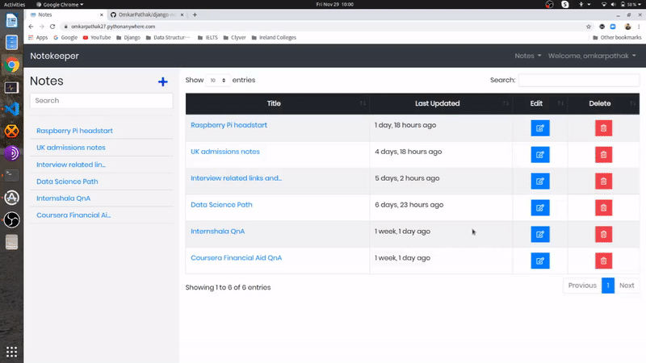

# django-notekeeper
A pretty easy django notes app. Have a note save it!

### Built with :heart: and :coffee: by [`Omkar Pathak`](http://www.omkarpathak.in/)

## Features

- CRUD notes
- Copies selected text automatically
- Easily share
- Download note as PDF
- Beautiful yet simple UI
- Encrypted Data so that no one can phish it! ([using django-cryptography](https://github.com/georgemarshall/django-cryptography))

# Installation

- Clone the repository

```bash
git clone https://github.com/OmkarPathak/django-notekeeper.git
```

- Install Dependencies

```bash
cd django-notekeeper
pip install -r requirements.txt
```

- Create a file names `.env` in the folder where your `settings.py` file is present. Enter following information in your .env file

```
SECRET_KEY=<your_secret_key>
```

- Run django migrations

```bash
python manage.py migrate
```

- Run django server

```bash
python manage.py runserver
```

# Working



# Donation

If you have found my softwares to be of any use to you, do consider helping me pay my internet bills. This would encourage me to create many such softwares :)

| PayPal | <a href="https://paypal.me/omkarpathak27" target="_blank"></a> |
|:-------------------------------------------:|:-------------------------------------------------------------:|
| ₹ (INR)  | <a href="https://www.instamojo.com/@omkarpathak/" target="_blank"></a> |
